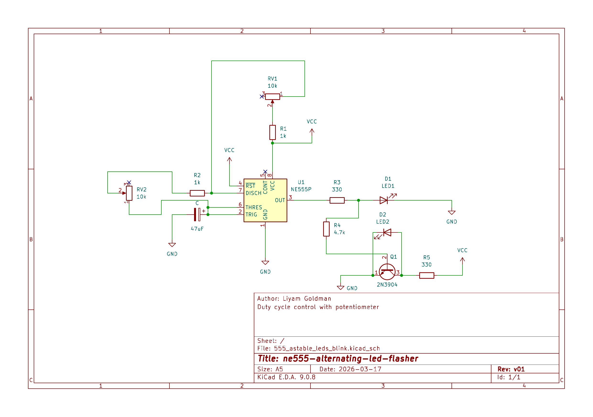
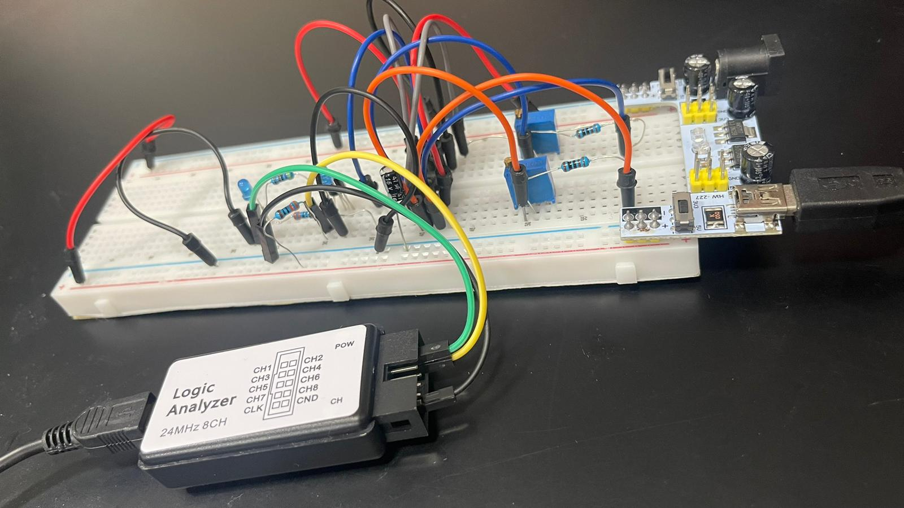
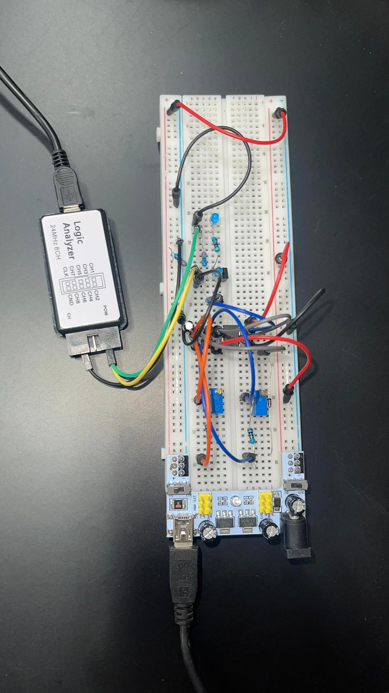

# NE555 Alternating LED Flasher Circuit

This project demonstrates the design and implementation of an astable timer circuit using the NE555 timer IC.  
The circuit was built as part of hands-on practice in electronic circuit design, focusing on understanding how to build working hardware using basic components such as resistors, capacitors, diodes, transistors, and integrated circuits.

The circuit generates a periodic signal that drives two LEDs in alternating states using an NPN transistor stage.

---

## Features

- Astable oscillator using NE555
- Adjustable timing using potentiometers
- Duty cycle control using diode across R2
- Complementary LED outputs
- NPN transistor used as output inverter / switch
- Verified using logic analyzer measurements

---

## Schematic

PDF version:

[Download schematic](docs/schematic.pdf)

---

## Hardware setup

Breadboard implementation of the circuit.

---

## Logic analyzer results

### Max R2 (LED2 is ON longer than LED1)

### R1 ≈ R2 (approximately equal duty cycle)

### Max R1 (LED1 is ON longer than LED2)

---

## Video demo

[Watch video](video/demo.mp4)

---

## Components

- NE555 timer IC
- 2N3904 NPN transistor
- Timing capacitor (47µF)

Resistors:
- LED current limiting resistors
- Base resistor for NPN transistor
- Series resistors with potentiometers (to limit minimum resistance)

Adjustable elements:
- 2 × Potentiometers used as part of R1 and R2 timing network

Diode:
- Diode placed in parallel to R2 to separate charge and discharge paths

Power supply:
- 5V DC

---

## Circuit Description

The NE555 is configured in astable mode.

Pins 2 and 6 are connected together to monitor the capacitor voltage.  
The internal comparators compare the capacitor voltage to 1/3 Vcc and 2/3 Vcc.

A flip-flop controls the output state, and pin 7 controls the internal discharge transistor.

The timing network consists of:

- R1 = fixed resistor + potentiometer in series
- R2 = fixed resistor + potentiometer in series
- A diode placed in parallel to R2 to separate charge and discharge paths

This allows independent adjustment of charge and discharge time, resulting in nearly symmetric ON/OFF timing.

The output at pin 3 drives:

- One LED directly through a current limiting resistor
- One LED through an NPN transistor, acting as an inverter / switch

This creates alternating blinking between the two LEDs.

---

## Purpose

This project was built as part of practical electronics learning, with the goal of improving understanding of:

- Analog timing circuits
- Internal operation of the NE555 timer
- RC charge and discharge behavior
- Duty cycle control using diodes
- Using BJTs as switching devices
- Designing and testing real electronic circuits
- Debugging hardware using measurement tools

---

## Author

Liyam Goldman

---

## License

This project is licensed under the MIT License.
See the License file for details.
